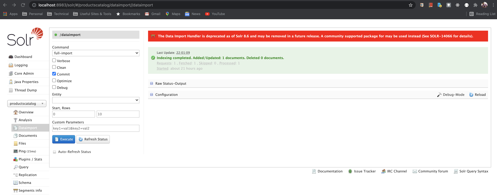
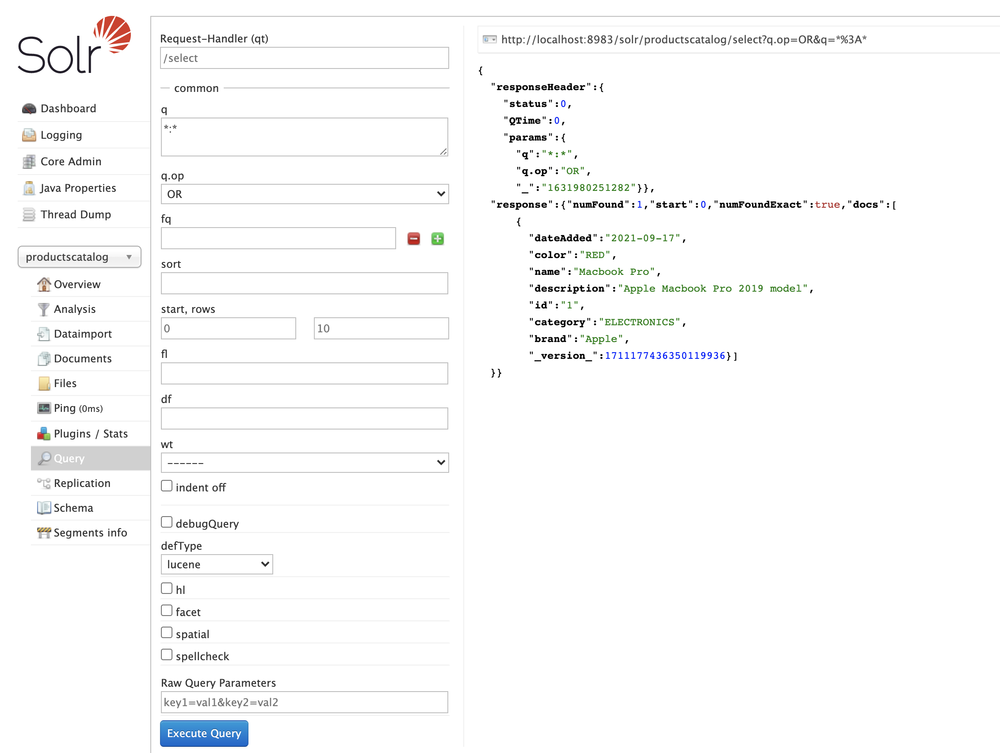

### Steps to setup Solr Data Import Handler (DIH) for PostgreSQL

[Config files](./dih_config_files "Config Files") used in this example

1. Create a (sample) table in PostgreSQL:

   ```sql
   CREATE TABLE products
   (id BIGINT GENERATED BY DEFAULT AS IDENTITY,
   name TEXT NOT NULL,
   category TEXT NOT NULL,
   brand TEXT NOT NULL,
   description TEXT NOT NULL,
   color TEXT,
   date_added date NOT NULL,
   PRIMARY KEY (id));
   ```

2. Add a sample record:

   ```sql
   INSERT INTO products ("id", "name", "category", "brand", "description", "color", "date_added") VALUES
   (1, 'Macbook Pro', 'ELECTRONICS', 'Apple', 'Apple Macbook Pro 2019 model', 'RED', '2021-09-17');
   ```

3. Create a new core:

   ```
   $ ./solr create -c productscatalog
   ```

   It should be visible in the solr admin dashboard:

   


4. Go to the `conf` directory in the newly created core:

   ```
   cd $SOLR_HOME/server/solr/productscatalog/conf
   ```

   Three files are important for us:

   - solrconfig.xml
   - data-config.xml
   - schema.xml


5. Download JDBC driver for PostgreSQL from [here](https://jdbc.postgresql.org/download.html "PostgreSQL JDBC driver")
   
   Place the jar file at:

   ```shell
   $SOLR_HOME/contrib/dataimporthandler/lib
   ```

   ```shell
   $ ls -lrt
   total 2048
   -rw-r--r--@ 1 abhinavnath  staff  1005522 Sep 17 22:08 postgresql-42.2.23.jar
   ```

6. `solrconfig.xml` changes:

   - Add below `lib` paths:
     ```xml
     <lib dir="${solr.install.dir:../../../..}/contrib/dataimporthandler/lib" regex=".*\.jar" />
     <lib dir="${solr.install.dir:../../../..}/dist/" regex="solr-dataimporthandler-.*\.jar" />
     ```

   - Add a new `requestHandler`:
     ```xml
     <!-- A request handler for productscatalog data import handler -->
     <requestHandler name="/dataimport" class="org.apache.solr.handler.dataimport.DataImportHandler">
       <lst name="defaults">
         <str name="config">data-config.xml</str>
       </lst>
     </requestHandler>
     ```


7. Create `data-config.xml` file:

   ```xml
   <dataConfig>
     <dataSource type="JdbcDataSource" name="productscatalog" driver="org.postgresql.Driver" url="jdbc:postgresql://127.0.0.1:5432/products-db" user="postgres" password="postgres" />
     <document name="products_catalog">
       <entity name="products" query="SELECT * FROM products;">
         <field column="id" name="id" />
         <field column="name" name="name" />
         <field column="category" name="category" />
         <field column="brand" name="brand" />
         <field column="description" name="description" />
         <field column="color" name="color" />
         <field column="date_added" name="dateAdded" />
       </entity>
     </document>
   </dataConfig>
   ```


8. Rename `managed-schema` file to `schema.xml`

   ```shell
   $ mv managed-schema schema.xml
   ```

   Add the fields that we mapped in `data-config.xml`:

   ```xml
   <field name="id" type="string" indexed="true" stored="true" required="true" multiValued="false" />
   <field name="name" type="string" indexed="true" stored="true" />
   <field name="category" type="string" indexed="true" stored="true" />
   <field name="brand" type="string" indexed="true" stored="true" />
   <field name="description" type="string" indexed="true" stored="true" />
   <field name="color" type="string" indexed="true" stored="true" />
   <field name="dateAdded" type="string" indexed="true" stored="true" />
   ```


9. Start Solr

   ```shell
   $ ./solr start
   ```


10. Use `DataImport` option to index the data

   - Go to Solr Admin Dashboard
   - Go to `DataImport` option and choose the `full-import` command from the drop-down
   - Hit `Execute`
     
   
   - DataImport should successfully index one document
     


11. Query the newly indexed document using the `Request-Handler`

    